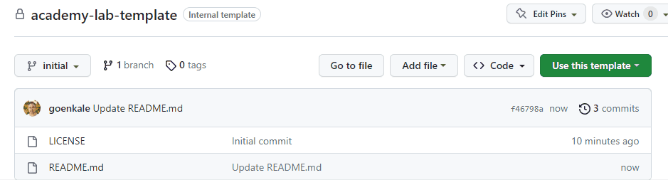

# academy-lab-template
Use this template to distribute the course's opening and closing materials. Typically a java source code, a.bpmn file, a.json file, etc.

## initial branch
It will have the materials students require to begin their practical exercises.

## solution branch (optional)
It will have all the information the students could require to compare with or address any problems they might encounter throughout their practical exercise.

**📖 Instructions**
---

1. Create a new GitHub project from `this` template and name it following this naming convention: **c8-course-name-lab**.

  

2. Configure your repository visibility as "Internal" during development
3. Add your initial content into the default **initial** branch
4. _(Optional)_ Create a new **solution** branch to add your final content
5. Use the link of each branch to share this training material publicly during the training
6. Configure your repository visibility as "Public" when the course is published

